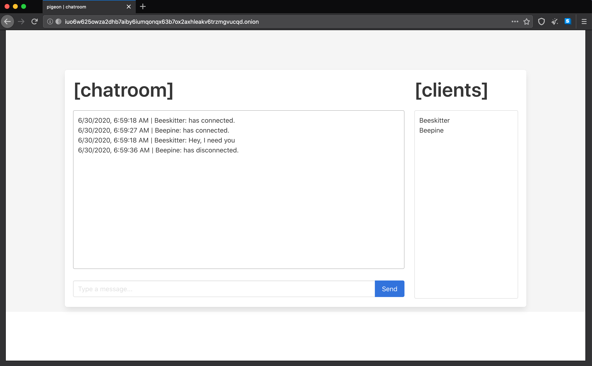

# pigeon [](https://github.com/ciehanski/pigeon/actions) [](https://coveralls.io/github/ciehanski/pigeon?branch=master) [](https://goreportcard.com/report/github.com/ciehanski/pigeon) [](https://app.fossa.com/projects/git%2Bgithub.com%2Fciehanski%2Fpigeon?ref=badge_shield)

pigeon is an instant messaging service built utilizing WebSockets 
and Tor hidden services as the transport mechanism. pigeon also
works without issue on Tor's strictest settings. The frontend is 
built with [Bulma](https://bulma.io/) and vanilla JavaScript. All 
JavaScript code is well-documented and can be found [here](https://github.com/ciehanski/pigeon/blob/master/templates/chatroom.go).



## Build/Install

You will need the the [Go toolchain](https://golang.org/dl/). Sadly, this will not 
work with Windows or macOS. You can build from source with the `Makefile`:

```bash
$ git clone https://github.com/ciehanski/pigeon .
$ cd pigeon && make build
```

## Usage

Once you have the `pigeon` binary simply make it executable and run it with the various flags
provided:

```bash
$ chmod +x pigeon 
$ ./pigeon -port 8080 -debug

    -port <int> : tell pigeon which port to make your onion service remotely
    available on.

    -torv3 <bool> : tell pigeon to run on torv3 or torv2.

    -debug <bool> : tell pigeon to print debug logs or silence logs.
```

## Contributing:

Contributions and PRs are welcome!

You can get started by either forking or cloning the repo. After, you can get started
by running:

```bash
make run
```

This will go ahead and build everything necessary to interface with Tor. After compose
has completed building, you will have a new `pigeon` container which will be your
dev environment.

Anytime a change to a .go or .mod file is detected the container will rerun with
the changes you have made. You must save in your IDE or text editor for the 
changes to be picked up. It takes roughly ~30 seconds for pigeon to restart after 
you have made changes.

You can completely restart the build with:
```bash
make restart
```

Run tests:
```bash
make exec
make test
```

Get container logs:
```bash
make logs
```

Shell into docker container:
```bash
make exec
```

Lint the project:
```bash
make lint
```

## License
- AGPLv3

[](https://app.fossa.com/projects/git%2Bgithub.com%2Fciehanski%2Fpigeon?ref=badge_large)
